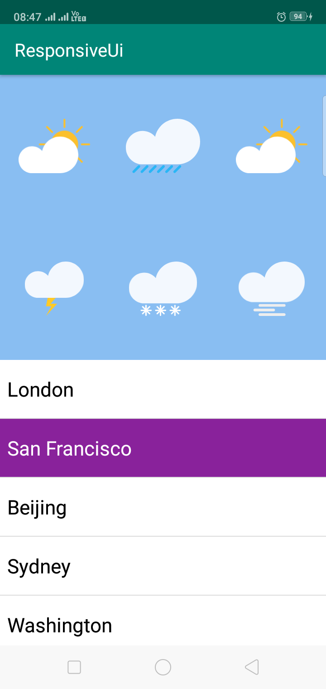
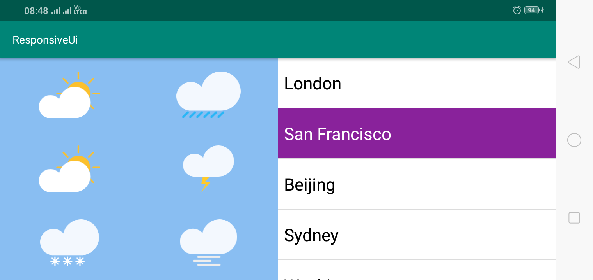

# Kotlin-Android-Adaptive-UI

<strong>#Build Gradle<strong> 
Add Dependency  
<code>implementation 'com.google.android:flexbox:0.3.2'</code>

<h2>Screenshot</h2>
<h3>Potrait Screenshot</h3>

<h3>Landscape Screenshot</h3>

